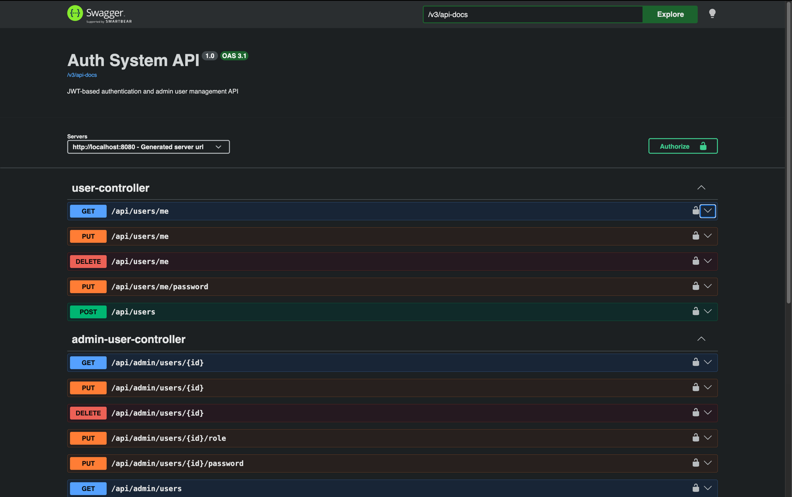
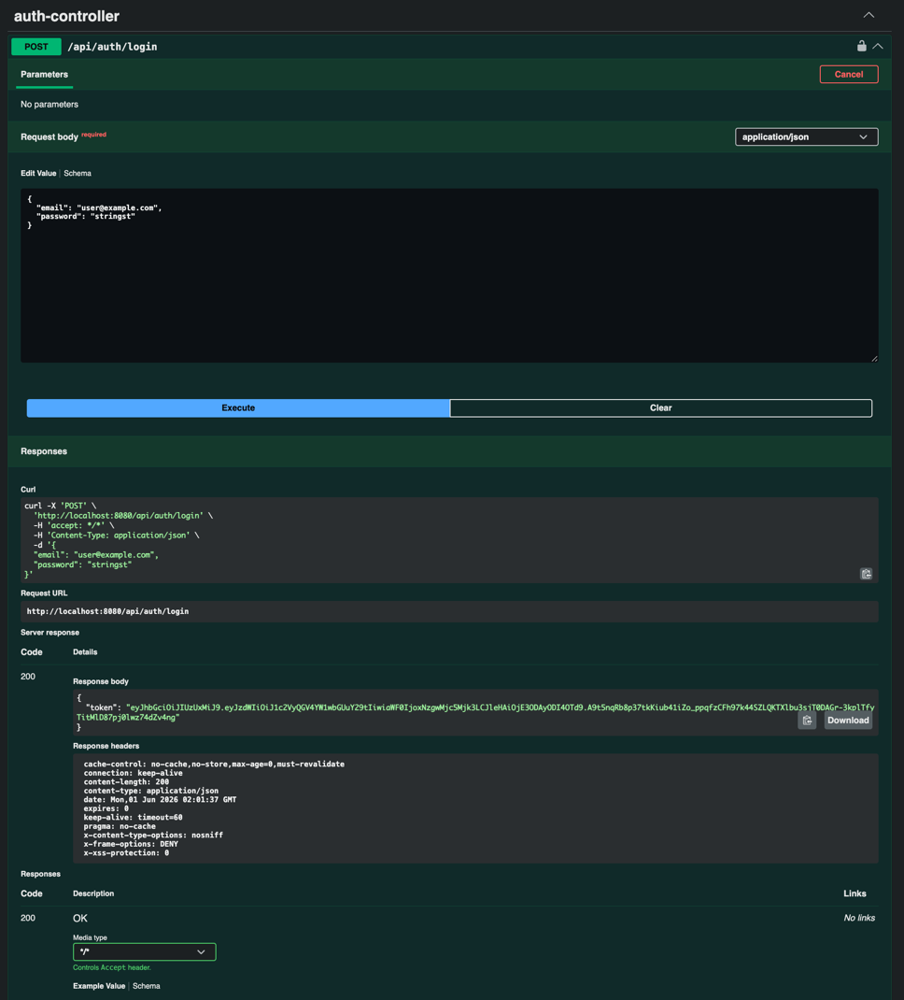
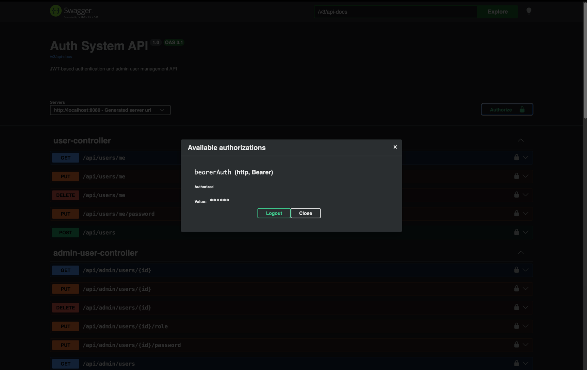
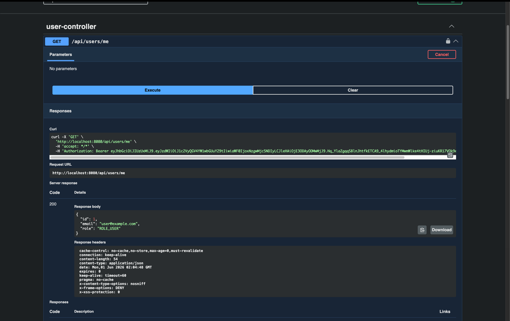

# AuthSystemAPI

## Overview
A Spring Boot REST API for user authentication, JWT-based authorization,
self-service account management, admin user management, and login brute-force
protection.

The project emphasizes secure backend development, layered architecture, 
and containerized deployment practices commonly used in enterprise applications.

This project is designed as a backend portfolio project focused on clean API design,
layered architecture, security fundamentals, and professional REST practices.
---

## Features
- User registration
- User login with JWT token generation
- BCrypt password hashing
- JWT authentication filter
- Role-based authorization
- Self-service user endpoints
- Admin-only user management endpoints
- Email and IP-based login rate limiting
- Request validation
- Global exception handling
- Swagger/OpenAPI documentation
---

## Tech Stack
- Java 21
- Spring Boot 4
- Spring Security
- Spring Data JPA
- MySQL
- Lombok
- JJWT
- Springdoc OpenAPI / Swagger UI
- Maven
- Docker
- Docker Compose
---

## Architecture

The application follows a layered architecture:
```text
Controller → Service → Repository → Database
```

### Layers

#### Controllers
Handle HTTP requests and responses.

#### Services
Contain business logic, validation logic, and authorization rules.

#### Repositories
Handle database access using Spring Data JPA.

#### Security Components
Handle JWT authentication, authorization filters, and request security.

---
## Security Features

### Password Security
Passwords are hashed using BCrypt before being stored in the 
database.
Raw passwords are never returned in API responses.

### JWT Authentication
After a successful login, the API returns a JWT access token.

Protected endpoints require:
```http
Authorization: Bearer <token>
```

### Role-Based Authorization
The API supports two roles:

```text
ROLE_USER
ROLE_ADMIN
```
- Normal users can only manage their account through `/api/users/me`.
- Admins can manage normal user accounts through `/api/admin/users`.

### Admin Protection Rules
Admin accounts cannot be modified or deleted through admin management endpoints.
This prevents admins from accidentally deleting, demoting, or modifying other admin 
accounts.

### Login Rate Limiting
The login endpoint is protected against brute-force attacks using:
- Email-based failed login tracking
- IP-based failed login tracking
- Temporary lockout after repeated failures

After too many failed login attempts, the API returns:
```http
429 Too Many Requests
```
---

## API Documentation
Swagger UI is available at
```
http://localhost:8080/swagger-ui/index.html
```
OpenAPI JSON is available at
```
http://localhost:8080/v3/api-docs
```
Swagger supports JWT authorization through the Authorize button.
Login first, copy the token, then paste the token into Swagger's authorization modal.
---

## Main Endpoints

### Authentication

| Method | Endpoint           | Description           | Access  |
|--------|--------------------|-----------------------|---------|
| POST   | `/api/auth/login`  | Login and receive JWT | Public  |

### User Self-Service

| Method | Endpoint                 | Description                    | Access        |
|--------|--------------------------|--------------------------------|---------------|
| POST   | `/api/users`             | Register new user              | Public        |
| GET    | `/api/users/me`          | Get current authenticated user | Authenticated |
| PUT    | `/api/users/me`          | Update current user's email    | Authenticated |
| PUT    | `/api/users/me/password` | Update current user's password | Authenticated |
| DELETE | `/api/users/me`          | Delete current user's account  | Authenticated |

### Admin User Management

| Method   | Endpoint                         | Description         | Access   |
|----------|----------------------------------|---------------------|----------|
| GET      | `/api/admin/users`               | Get all users       | Admin    |
| GET      | `/api/admin/users/{id}`          | Get user by ID      | Admin    |
| PUT      | `/api/admin/users/{id}`          | Update user email   | Admin    |
| PUT      | `/api/admin/users/{id}/password` | Reset user password | Admin    |
| PUT      | `/api/admin/users/{id}/role`     | Update user role    | Admin    |
| DELETE   | `/api/admin/users/{id}`          | Delete user         | Admin    |

### Example Login Request
```http
POST /api/auth/login
Content-Type: application/json
```
```json
{
  "email": "user@example.com",
  "password": "password123"
}
```
### Example Response

```json
{
  "token": "eyJhbGciOiJIUzI1NiJ9..."
}
```
### Example Error Response
```json
{
  "timestamp": "2026-05-28T12:30:00",
  "status": 401,
  "error": "Unauthorized",
  "message": "Invalid email or password",
  "path": "/api/auth/login",
  "validationErrors": null
}
```
Validation errors include field-specific messages:
```json
{
  "timestamp": "2026-05-28T12:30:00",
  "status": 400,
  "error": "Bad Request",
  "message": "Validation failed",
  "path": "/api/users",
  "validationErrors": {
    "email": "must not be blank",
    "password": "size must be between 8 and 2147483647"
  }
}
```
---

## Running with Docker

Start the application and MySQL database:

```bash
docker compose up --build
```

The API will be available at:
```text
http://localhost:8080
```

Swagger UI:
```text
http://localhost:8080/swagger-ui/index.html
```

MySQL is exposed locally on port `3307`

Stop containers:
```bash
docker compose down
```

---

## Local Development Setup

### 1. Clone the Repository
```bash
git clone https://github.com/DamaliBaker/auth-system-api.git
cd auth-system-api
```
### 2. Configure the Database
Create a MySQL database:
```sql
CREATE DATABASE auth_system_db;
```
### 3. Configure application properties
Create or update:
```text
src/main/resources/application.properties
```
Example
```text
spring.datasource.url=jdbc:mysql://localhost:3306/auth_system_db
spring.datasource.username=your_mysql_username
spring.datasource.password=your_mysql_password

spring.jpa.hibernate.ddl-auto=update
spring.jpa.show-sql=true

jwt.secret=${JWT_SECRET}
jwt.expiration=${JWT_EXPIRATION}
```
Do not commit real secrets to GitHub.

For production, use environment variables or a secrets manager.

### 4. Run the app
```bash
mvn spring-boot:run
```
The API runs on
```text
http://localhost:8080
```

### Creating an Admin User
- New registered users are created with `ROLE_USER`
- For local development, manually promote a user in the database:

```sql
UPDATE users
SET role = 'ROLE_ADMIN'
WHERE email = 'admin@example.com';
```
Then log in again to test admin endpoints.

---

## Project Structure
```text
src/main/java/ca/sheridancollege/bakerdam/authsystemapi
├── config
├── controller
├── dto
│   ├── request
│   └── response
├── entity
│   └── enums
├── exception
├── mapper
├── repository
├── security
└── service
```
---

## Environment Variables

Recommended production-style variables:

```text
DB_URL
DB_USERNAME
DB_PASSWORD
JWT_SECRET
JWT_EXPIRATION
```
---

## Screenshots

### Swagger UI


### Successful JWT Authentication


### Authorized Swagger Session


### Protected Endpoint Access


---

## Future Improvements
- Add integration tests for authentication and admin flows.
- Add refresh token support for improved session management.
- Add logout/token revocation support.
- Replace Hibernate auto-update with Flyway database migrations.
- Add audit logs for admin actions.
- Add a `ROLE_SUPER_ADMIN` role for managing admin accounts.
- Move rate limiting to Redis or an API gateway for production scalability.
- Add deployment configuration for cloud hosting.
- Add GitHub Actions CI/CD pipeline.
---

## Status
Version 1 is focused on authentication, authorization, admin user management, API documentation, and login brute-force protection.